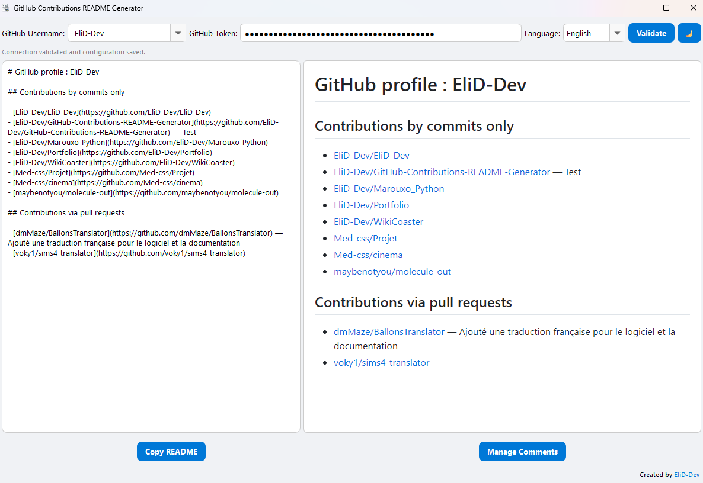

# GitHub Contributions README Generator

A desktop application that automatically generates a README file showcasing your GitHub contributions, organized by repository categories.

## Features

- **Automatic GitHub Integration**: Connects to your GitHub account via personal access token
- **Smart Repository Categorization**: Organizes contributions into commit-only repositories, pull requests, and other contributions
- **Multi-language Support**: Available in English, French, and Spanish
- **Theme Support**: Light and dark mode interface
- **Custom Comments**: Add personalized descriptions to your repositories
- **Markdown Preview**: Real-time preview of generated README content
- **Configuration Persistence**: Saves your settings and preferences

## Requirements

- Python 3.8 or higher
- PyQt6
- Internet connection for GitHub API access

## Installation

1. Clone this repository:
```bash
git clone https://github.com/your-username/github-readme-contributions.git
cd github-readme-contributions
```

2. Install required dependencies:
```bash
pip install -r requirements.txt
```

## Usage

1. Run the application:
```bash
python main.py
```

2. Enter your GitHub username and personal access token
3. Click "Validate" to fetch your contributions
4. Preview the generated README in the right panel
5. Copy the content or manage repository comments as needed

## GitHub Personal Access Token

To use this application, you need a GitHub Personal Access Token:

1. Go to GitHub Settings > Developer settings > Personal access tokens
2. Generate a new token with `read:user` and `repo` (public repositories) permissions
3. Copy the token and paste it in the application

## Project Structure

```
├── main.py                 # Application entry point
├── main_window.py          # Main application window
├── github_api.py           # GitHub API interactions
├── translation_manager.py  # Multi-language support
├── config_manager.py       # Configuration management
├── ui_components.py        # Reusable UI components
├── translations/           # Language files
│   ├── en.json
│   ├── fr.json
│   └── es.json
├── styles/                 # CSS themes
│   ├── github-markdown-light.css
│   └── github-markdown-dark.css
└── requirements.txt        # Python dependencies
```

## Configuration

The application automatically saves your configuration in `config.json`, including:

- Username history
- Theme preference
- Language selection
- Repository comments per user

## License

This project is open source and available under the GPL-3.0 license.

## Author

Created by EliD-Dev

## Support

If you encounter any issues or have questions, please open an issue on the GitHub repository.
